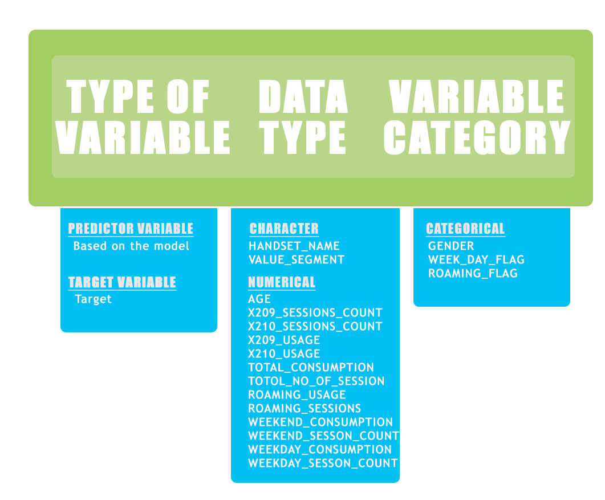
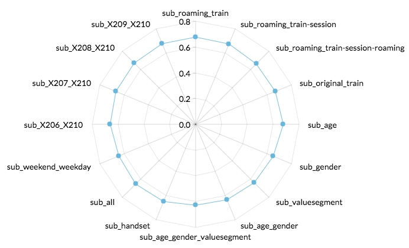

This Markdown explores 5 months data usage in Mega Bytes for 100K of Vodafone customers, subscribed to one of its rate plans. Our task is to predict whether a customer will exceed their average usage over the 5 months by 500 Mega Bytes in the coming month.

###Important to mention:
1. All the following models were trained using "neural network"" algorithm as it gave us the best performance compared to "randomForests", "rpart", "SVM", "naivebayes" and "logistic regression".

2. All models' performance was evaluated by calculating the auc using "pRoc" R package, and cross validations.

3. Our approach was to produce many different models trained based on different attributes (splitting and joining the datasets accordingly) thus; having different submission files ensembling all files together at the end to get the highest accuracy- following this guide [link](http://mlwave.com/kaggle-ensembling-guide/): 

First let's load all **required libraries**:

```{r, cache=TRUE}


library("dplyr")
library("ggplot2")
library('randomForest')
library('rpart')
library('dismo')
library('randomForest')
library('e1071')
library('adabag')
library('caret')
library('ipred')
library('C50')
library('stringi')
library('pROC')
library('nnet')
library('RWeka')
library('Boruta')
library('VIM')
library('DMwR')
library('mice')
library(gridExtra)

```

We started with loading the data:

```{r, cache=TRUE}

contract_ref <- read.csv("/Users/mayarelmohr/Documents/Semester10/DataScience/Vodafone2/StarBugs/VodafoneDataProject/contract_ref.csv")
daily_aggregate <- read.csv("/Users/mayarelmohr/Documents/Semester10/DataScience/Vodafone2/StarBugs/VodafoneDataProject/daily_aggregate.csv")
roaming_monthly <- read.csv("/Users/mayarelmohr/Documents/Semester10/DataScience/Vodafone2/StarBugs/VodafoneDataProject/roaming_monthly.csv")
calendar_ref <- read.csv("/Users/mayarelmohr/Documents/Semester10/DataScience/Vodafone2/StarBugs/VodafoneDataProject/calendar_ref.csv")
test <- read.csv("/Users/mayarelmohr/Documents/Semester10/DataScience/Vodafone2/StarBugs/VodafoneDataProject/test.csv")
train <- read.csv("/Users/mayarelmohr/Documents/Semester10/DataScience/Vodafone2/StarBugs/VodafoneDataProject/train.csv")
```

then, started **data exploration**, **cleaning** and **preparation**

###Variable Identification:
Identify Predictor (Input) and Target (Output) variables. Next, identify the data type and category of the variables.

```{r, cache=TRUE}
train %>% str()
contract_ref %>% str()
calendar_ref %>% str()
roaming_monthly %>% str()
daily_aggregate %>% str()
test %>% str()
```



###Missing Values Treatment:

First we inspect and plot the missing data in table **contract_ref**:

####1. VALUE_SEGMENT

```{r, cache=TRUE}
contract_ref$VALUE_SEGMENT[contract_ref$VALUE_SEGMENT == "N/A"] <- NA
md.pattern(contract_ref)
mice_plot <- aggr(contract_ref, col=c('darkolivegreen3','deepskyblue1'), alpha = 0.4, numbers=TRUE, border = FALSE, sortVars=TRUE, labels=names(contract_ref), cex.axis=.5, gap=2, ylab=c("Missing data","Pattern"))
marginplot(contract_ref[, c("AGE", "VALUE_SEGMENT")], col = c('darkolivegreen3','deepskyblue1'), delimiter = NULL, cex.numbers = 1.2, pch = 19, frame.plot = FALSE)
```

Imputing the NA's of the VALUE_SEGMENT in table contract_ref, using KNN Imputation where the missing values of an attribute are imputed using the given number of attributes that are most similar to the attribute whose values are missing:

```{r, cache=TRUE}
contract_ref_imputed <- knnImputation(contract_ref)
```

    


####2.GENDER

First we change the gender values to Male, Female, Not enetered, instead of having f, F, m, M, Unknown.

```{r, cache=TRUE}
levels(contract_ref_imputed$GENDER)[levels(contract_ref_imputed$GENDER) == "F"] <- "Female"
levels(contract_ref_imputed$GENDER)[levels(contract_ref_imputed$GENDER) == "f"] <- "Female"
levels(contract_ref_imputed$GENDER)[levels(contract_ref_imputed$GENDER) == "m"] <- "Male"
levels(contract_ref_imputed$GENDER)[levels(contract_ref_imputed$GENDER) == "M"] <- "Male"
levels(contract_ref_imputed$GENDER)[levels(contract_ref_imputed$GENDER) == "Unknown"] <- "Not Entered"
```

Proceed plotting the GENDER distribution:

```{r, cache=TRUE}
train_contract_ref_imputed <- inner_join(train, contract_ref_imputed, BY = "CONTRACT_KEY")


qplot(TARGET, data=train_contract_ref_imputed, fill=GENDER, geom="bar") + scale_fill_manual(values=c("darkolivegreen3", "deepskyblue1", "gray"))
qplot(GENDER, data=train_contract_ref_imputed, fill=factor(TARGET))  + scale_fill_manual(values=c("darkolivegreen3", "deepskyblue1"))

```


####3. AGE
The age has some -ve values where we assumed its a wrong entry, and a alot of 99 values, which corresponds to the gender of Not Entered where we assumed that all the 99 values are NA's.

We performed Mean Imputation according to the corresponding value segment, where we grouped the age into two groups

1- Group with age < 16, where it's illegal to sign a contract from a Telcom agency

2- Group with age = 99


```{r, cache=TRUE}

contract_ref_filtered = filter(contract_ref_imputed, as.numeric(contract_ref_imputed$AGE) >= 16)
contract_ref_filtered = filter(contract_ref_imputed, as.numeric(contract_ref_imputed$AGE) <= 95)


contract_ref_unfiltered = anti_join(contract_ref_imputed, contract_ref_filtered, by = "CONTRACT_KEY")


age_of_Core_Segment <- data.frame( contract_ref_filtered$AGE[contract_ref_filtered$VALUE_SEGMENT == 'Core'])
p1 <- ggplot() + geom_bar(data = age_of_Core_Segment, aes(x=age_of_Core_Segment$contract_ref_filtered.AGE.contract_ref_filtered.VALUE_SEGMENT....), fill = "darkolivegreen3" )  + ggtitle("Age of Core Value segment") + xlab("Age")

mean_core <- mean(as.numeric(age_of_Core_Segment$contract_ref_filtered.AGE.contract_ref_filtered.VALUE_SEGMENT....), na.rm= TRUE)

age_of_Med_low <- data.frame( contract_ref_filtered$AGE[contract_ref_filtered$VALUE_SEGMENT == 'Med-Low']) 
p2 <-ggplot()+  geom_histogram(data = age_of_Med_low, aes(x=age_of_Med_low$contract_ref_filtered.AGE.contract_ref_filtered.VALUE_SEGMENT....), fill = "deepskyblue1") + ggtitle("Age of Med Low Value segment") + xlab("Age") 


mean_med_low <- mean(as.numeric(age_of_Med_low$contract_ref_filtered.AGE.contract_ref_filtered.VALUE_SEGMENT....), na.rm= TRUE)

age_of_High_Segment <- data.frame( contract_ref_filtered$AGE[contract_ref_filtered$VALUE_SEGMENT == 'High'])
p3 <- ggplot() + geom_bar(data = age_of_High_Segment, aes(x=age_of_High_Segment$contract_ref_filtered.AGE.contract_ref_filtered.VALUE_SEGMENT....),  fill = "deepskyblue1")  + ggtitle("Age of High Value segment") + xlab("Age")


mean_high <- mean(as.numeric(age_of_High_Segment$contract_ref_filtered.AGE.contract_ref_filtered.VALUE_SEGMENT....), na.rm= TRUE)

age_of_Med_High_Segment <- data.frame( contract_ref_filtered$AGE[contract_ref_filtered$VALUE_SEGMENT == 'Med-High'])
p4 <- ggplot() + geom_bar(data = age_of_Med_High_Segment, aes(x=age_of_Med_High_Segment$contract_ref_filtered.AGE.contract_ref_filtered.VALUE_SEGMENT....),  fill = "darkolivegreen3")  + ggtitle("Age of Mid-High Value segment") + xlab("Age")
mean_med_high <- mean(as.numeric(age_of_Med_High_Segment$contract_ref_filtered.AGE.contract_ref_filtered.VALUE_SEGMENT....), na.rm= TRUE)


age_of_premium <- data.frame( contract_ref_filtered$AGE[contract_ref_filtered$VALUE_SEGMENT == 'Premium'])
p5 <- ggplot() + geom_bar(data = age_of_premium, aes(x=age_of_premium$contract_ref_filtered.AGE.contract_ref_filtered.VALUE_SEGMENT....),,  fill = "deepskyblue1")  + ggtitle("Age of premium Value segment") + xlab("Age")
mean_premium <- mean(as.numeric(age_of_premium$contract_ref_filtered.AGE.contract_ref_filtered.VALUE_SEGMENT....), na.rm= TRUE)


age_of_platinum <- data.frame( contract_ref_filtered$AGE[contract_ref_filtered$VALUE_SEGMENT == 'Platinum'])
p6 <- ggplot() + geom_bar(data = age_of_platinum, aes(x=age_of_platinum$contract_ref_filtered.AGE.contract_ref_filtered.VALUE_SEGMENT....),  fill = "darkolivegreen3")  + ggtitle("Age of platinum Value segment") + xlab("Age")
mean_platinum <- mean(as.numeric(age_of_platinum$contract_ref_filtered.AGE.contract_ref_filtered.VALUE_SEGMENT....), na.rm = TRUE)

contract_ref_unfiltered$AGE[contract_ref_unfiltered$VALUE_SEGMENT ==as.character("Core") ] = as.integer(mean_core)
contract_ref_unfiltered$AGE[contract_ref_unfiltered$VALUE_SEGMENT ==as.character("High") ] = as.integer(mean_high)
contract_ref_unfiltered$AGE[contract_ref_unfiltered$VALUE_SEGMENT ==as.character("Med-Low") ] = as.integer(mean_med_low)
contract_ref_unfiltered$AGE[contract_ref_unfiltered$VALUE_SEGMENT ==as.character("Med-High") ] = as.integer(mean_med_high)
contract_ref_unfiltered$AGE[contract_ref_unfiltered$VALUE_SEGMENT ==as.character("Premium") ] = as.integer(mean_premium)
contract_ref_unfiltered$AGE[contract_ref_unfiltered$VALUE_SEGMENT ==as.character("Platinum") ] = as.integer(mean_platinum)


contract_ref_new = bind_rows(contract_ref_unfiltered, contract_ref_filtered)


```

Value segments of 'Med-Low' and 'Med-High' were both combined to a 'Medium' value segment 

```{r, cache=TRUE}
levels(contract_ref_new$VALUE_SEGMENT)[contract_ref_new$VALUE_SEGMENT == "Med-High"] = "Medium"
levels(contract_ref_new$VALUE_SEGMENT)[contract_ref_new$VALUE_SEGMENT == "Med-Low"] = "Medium"
contract_ref_new$VALUE_SEGMENT[contract_ref_new$VALUE_SEGMENT == "Med-High"] = "Medium"
contract_ref_new$VALUE_SEGMENT[contract_ref_new$VALUE_SEGMENT == "Med-Low"] = "Medium"

```             

Below is a graph for age distribution within each value segment

```{r, cache=TRUE}

grid.arrange(p1,p2,p3,p4,p5,p6, ncol = 2, nrow = 3)
```


####4.HANDSET NAME

Handset names were grouped by types to reduce their levels according to the brand where we assumed that the handset would affect the consumption especially the internet usage.
We googled and researched the mobiles of unfamilar brands to group them together, also we figured that some of the handsets resembled companies and agencies thus we grouped them together to a new level called "Agency"

They were clustered into less levels
Below is a graph showing the occurence of value segments within the given contract _ref
```{r, cache=TRUE}


ggplot() + geom_bar(data = contract_ref_new, aes(x=VALUE_SEGMENT),  fill = "darkolivegreen3")  + ggtitle("Occurence of Value segments withing the given contract _ref") + xlab("Value Segment")
```


```{r, cache=TRUE}

contract_ref_new$HANDSET_NAME <- sub(".*Samsung.*", "Samsung", contract_ref_new$HANDSET_NAME, ignore.case = TRUE)
contract_ref_new$HANDSET_NAME <- sub(".*Sony.*", "Sony", contract_ref_new$HANDSET_NAME, ignore.case = TRUE)
contract_ref_new$HANDSET_NAME <- sub(".*Apple.*", "Apple", contract_ref_new$HANDSET_NAME, ignore.case = TRUE)
contract_ref_new$HANDSET_NAME <- sub(".*GoogleNexus.*", "GoogleNexus", contract_ref_new$HANDSET_NAME, ignore.case = TRUE)
contract_ref_new$HANDSET_NAME <- sub(".*BlackBerry.*", "BlackBerry", contract_ref_new$HANDSET_NAME, ignore.case = TRUE)
contract_ref_new$HANDSET_NAME <- sub(".*Asus.*", "Asus", contract_ref_new$HANDSET_NAME, ignore.case = TRUE)
contract_ref_new$HANDSET_NAME <- sub(".*Vodafone.*", "Vodafone", contract_ref_new$HANDSET_NAME, ignore.case = TRUE)
contract_ref_new$HANDSET_NAME <- sub(".*HTC.*", "HTC", contract_ref_new$HANDSET_NAME, ignore.case = TRUE)
contract_ref_new$HANDSET_NAME <- sub(".*Lenovo.*", "Lenovo", contract_ref_new$HANDSET_NAME, ignore.case = TRUE)
contract_ref_new$HANDSET_NAME <- sub(".*Simcom.*", "Simcom", contract_ref_new$HANDSET_NAME, ignore.case = TRUE)
contract_ref_new$HANDSET_NAME <- sub(".*Microsoft.*", "Microsoft", contract_ref_new$HANDSET_NAME, ignore.case = TRUE)
contract_ref_new$HANDSET_NAME <- sub(".*Huawei.*", "Huawei", contract_ref_new$HANDSET_NAME, ignore.case = TRUE)
contract_ref_new$HANDSET_NAME <- sub(".*Alcatel.*", "Alcatel", contract_ref_new$HANDSET_NAME, ignore.case = TRUE)
contract_ref_new$HANDSET_NAME <- sub(".*Nokia.*", "Nokia", contract_ref_new$HANDSET_NAME, ignore.case = TRUE)
contract_ref_new$HANDSET_NAME <- sub(".*Sico.*", "Sico", contract_ref_new$HANDSET_NAME, ignore.case = TRUE)
contract_ref_new$HANDSET_NAME <- sub(".*Beryl.*", "Beryl", contract_ref_new$HANDSET_NAME, ignore.case = TRUE)
contract_ref_new$HANDSET_NAME <- sub(".*TP-Link.*", "TP-Link", contract_ref_new$HANDSET_NAME, ignore.case = TRUE)
contract_ref_new$HANDSET_NAME <- sub(".*Fibocom.*", "Fibocom", contract_ref_new$HANDSET_NAME, ignore.case = TRUE)
contract_ref_new$HANDSET_NAME <- sub(".*Verifone.*", "Verifone", contract_ref_new$HANDSET_NAME, ignore.case = TRUE)
contract_ref_new$HANDSET_NAME <- sub(".*Cinterion.*", "Cinterion", contract_ref_new$HANDSET_NAME, ignore.case = TRUE)
contract_ref_new$HANDSET_NAME <- sub(".*Siemens.*", "Siemens", contract_ref_new$HANDSET_NAME, ignore.case = TRUE)
contract_ref_new$HANDSET_NAME <- sub(".*G-tide.*", "G-tide", contract_ref_new$HANDSET_NAME, ignore.case = TRUE)
contract_ref_new$HANDSET_NAME <- sub(".*Cisco.*", "Cisco", contract_ref_new$HANDSET_NAME, ignore.case = TRUE)
contract_ref_new$HANDSET_NAME <- sub(".*Quectel.*", "QuectelWirelessSolutions", contract_ref_new$HANDSET_NAME, ignore.case = TRUE)
contract_ref_new$HANDSET_NAME <- sub(".*Assure.*", "Assure", contract_ref_new$HANDSET_NAME, ignore.case = TRUE)
contract_ref_new$HANDSET_NAME <- sub(".*Arab.*", "Agency", contract_ref_new$HANDSET_NAME, ignore.case = TRUE)
contract_ref_new$HANDSET_NAME <- sub(".*tele.*", "Agency", contract_ref_new$HANDSET_NAME, ignore.case = TRUE)
contract_ref_new$HANDSET_NAME <- sub(".*Tele.*", "Agency", contract_ref_new$HANDSET_NAME, ignore.case = TRUE)
contract_ref_new$HANDSET_NAME <- sub(".*ZTE.*", "ZTE", contract_ref_new$HANDSET_NAME, ignore.case = TRUE)
contract_ref_new$HANDSET_NAME <- sub(".*ACER.*", "ACER", contract_ref_new$HANDSET_NAME, ignore.case = TRUE)
contract_ref_new$HANDSET_NAME <- sub(".*Ace.*", "Agency", contract_ref_new$HANDSET_NAME, ignore.case = TRUE)
contract_ref_new$HANDSET_NAME <- sub(".*ZTS.*", "Agency", contract_ref_new$HANDSET_NAME, ignore.case = TRUE)
contract_ref_new$HANDSET_NAME <- sub(".*ZTC.*", "ZTC", contract_ref_new$HANDSET_NAME, ignore.case = TRUE)
contract_ref_new$HANDSET_NAME <- sub(".*Express.*", "Agency", contract_ref_new$HANDSET_NAME, ignore.case = TRUE)
contract_ref_new$HANDSET_NAME <- sub(".*Technology.*", "Agency", contract_ref_new$HANDSET_NAME, ignore.case = TRUE)
contract_ref_new$HANDSET_NAME <- sub(".*technology.*", "Agency", contract_ref_new$HANDSET_NAME, ignore.case = TRUE)
contract_ref_new$HANDSET_NAME <- sub(".*tech.*", "Agency", contract_ref_new$HANDSET_NAME, ignore.case = TRUE)
contract_ref_new$HANDSET_NAME <- sub(".*tec.*", "Agency", contract_ref_new$HANDSET_NAME, ignore.case = TRUE)
contract_ref_new$HANDSET_NAME <- sub(".*Xiaomi.*", "Agency", contract_ref_new$HANDSET_NAME, ignore.case = TRUE)
contract_ref_new$HANDSET_NAME <- sub(".*Wiko.*", "Wiko", contract_ref_new$HANDSET_NAME, ignore.case = TRUE)
contract_ref_new$HANDSET_NAME <- sub(".*Souq.*", "Agency", contract_ref_new$HANDSET_NAME, ignore.case = TRUE)
contract_ref_new$HANDSET_NAME <- sub(".*Sierra.*", "Agency", contract_ref_new$HANDSET_NAME, ignore.case = TRUE)
contract_ref_new$HANDSET_NAME <- sub(".*Motorola.*", "Motorola", contract_ref_new$HANDSET_NAME, ignore.case = TRUE)
contract_ref_new$HANDSET_NAME <- sub(".*Hisense.*", "Agency", contract_ref_new$HANDSET_NAME, ignore.case = TRUE)
contract_ref_new$HANDSET_NAME <- sub(".*Trading.*", "Agency", contract_ref_new$HANDSET_NAME, ignore.case = TRUE)
contract_ref_new$HANDSET_NAME <- sub(".*Telit.*", "Agency", contract_ref_new$HANDSET_NAME, ignore.case = TRUE)
contract_ref_new$HANDSET_NAME <- sub(".*Lulu.*", "Lulu", contract_ref_new$HANDSET_NAME, ignore.case = TRUE)
contract_ref_new$HANDSET_NAME <- sub(".*LG.*", "LG", contract_ref_new$HANDSET_NAME, ignore.case = TRUE)
contract_ref_new$HANDSET_NAME <- sub(".*HP.*", "HP", contract_ref_new$HANDSET_NAME, ignore.case = TRUE)
contract_ref_new$HANDSET_NAME <- sub(".*Group.*", "Group", contract_ref_new$HANDSET_NAME, ignore.case = TRUE)
contract_ref_new$HANDSET_NAME <- sub(".*Goldgoal.*", "Agency", contract_ref_new$HANDSET_NAME, ignore.case = TRUE)
contract_ref_new$HANDSET_NAME <- sub(".*Goldgoal .*", "Agency", contract_ref_new$HANDSET_NAME, ignore.case = TRUE)
contract_ref_new$HANDSET_NAME <- sub(".* Goldgoal .*", "Agency", contract_ref_new$HANDSET_NAME, ignore.case = TRUE)
contract_ref_new$HANDSET_NAME <- sub(".*Import.*", "Agency", contract_ref_new$HANDSET_NAME, ignore.case = TRUE)
contract_ref_new$HANDSET_NAME <- sub(".*ARCHOS.*", "ARCHOS", contract_ref_new$HANDSET_NAME, ignore.case = TRUE)
contract_ref_new$HANDSET_NAME <- sub(".* Coolpad.*", " Coolpad", contract_ref_new$HANDSET_NAME, ignore.case = TRUE)
contract_ref_new$HANDSET_NAME <- sub(".*Oppo.*", "Oppo", contract_ref_new$HANDSET_NAME, ignore.case = TRUE)
contract_ref_new$HANDSET_NAME <- sub(".*Sharp.*", "Sharp", contract_ref_new$HANDSET_NAME, ignore.case = TRUE)
contract_ref_new$HANDSET_NAME <- sub(".*Panasonic.*", "Panasonic", contract_ref_new$HANDSET_NAME, ignore.case = TRUE)
contract_ref_new$HANDSET_NAME <- sub(".* BLU.*", "BLU", contract_ref_new$HANDSET_NAME, ignore.case = TRUE)
contract_ref_new$HANDSET_NAME <- sub(".*BLU.*", "BLU", contract_ref_new$HANDSET_NAME, ignore.case = TRUE)
contract_ref_new$HANDSET_NAME <- sub(".*Infinix.*", "Infinix", contract_ref_new$HANDSET_NAME, ignore.case = TRUE)
contract_ref_new$HANDSET_NAME <- sub(".*Shenzhen.*", "Shenzhen", contract_ref_new$HANDSET_NAME, ignore.case = TRUE)
contract_ref_new$HANDSET_NAME <- sub(".*Teltonika.*", "Teltonika", contract_ref_new$HANDSET_NAME, ignore.case = TRUE)
contract_ref_new$HANDSET_NAME <- sub(".*Sagem.*", "Agency", contract_ref_new$HANDSET_NAME, ignore.case = TRUE)
contract_ref_new$HANDSET_NAME <- sub(".*Fly Mobiles.*", "Fly Mobiles", contract_ref_new$HANDSET_NAME, ignore.case = TRUE)
contract_ref_new$HANDSET_NAME <- sub(".*K-Touch.*", "K-Touch", contract_ref_new$HANDSET_NAME, ignore.case = TRUE)
contract_ref_new$HANDSET_NAME <- sub(".*OnePlus.*", "OnePlus", contract_ref_new$HANDSET_NAME, ignore.case = TRUE)
contract_ref_new$HANDSET_NAME <- as.factor(contract_ref_new$HANDSET_NAME)

```

After doing, some feature engineering, we created a new instance of traing set that has the usage and session counts of the last two month, in addition to the total of usage and sessions of the first three months, with AUC score = 0.667

```{r, cache=TRUE}


train_9_10 <- train

train_9_10  <-  cbind(TOTAL_USAGE = (train$X206_USAGE + train$X207_USAGE  +train$X208_USAGE ), train_9_10)

train_9_10 <-  cbind(TOTAL_SESSIONS = (train$X206_SESSION_COUNT + train$X207_SESSION_COUNT  +train$X208_SESSION_COUNT ), train_9_10)

train_9_10 <- dplyr::select(train_9_10, -c( X206_SESSION_COUNT, X207_SESSION_COUNT, X208_SESSION_COUNT,
 X206_USAGE, X207_USAGE, X208_USAGE ))
nn <- make_Weka_classifier("weka/classifiers/functions/MultilayerPerceptron")
model <- nn(as.factor(TARGET)~. -CONTRACT_KEY, data= train_9_10)
predictedFold <- data.frame(predict(model,  train_9_10[1:7], type = "class"))
auc(as.numeric(train_9_10$TARGET), as.numeric(predictedFold$predict.model..train_9_10.1.7...type....class..))

```


Next, we inspect and plot the **daily_aggregate** to get some sights about the ROAMING and LOCAL:
Having all the roaming and local usage and number of sessions prepared in extrernal .csv file, we load them directly, then join the tables accordingly:


```{r, cache=TRUE}


local_consumption <- read.csv("local_consumption.csv")
roaming_consumption <- read.csv("roaming_consumption.csv")
local_sessions_count <- read.csv("local_sessions_count.csv")
roaming_sessions_count <- read.csv("roaming_sessions_count.csv")

```

Here, we add the roaming and local consumption of the last two months to the new training set, with AUC score 0.6768

```{r}

train_roaming <- dplyr::left_join(train_9_10, local_sessions_count, BY = "CONTRACT_KEY")
train_roaming <- dplyr::left_join(train_roaming, local_consumption, BY = "CONTRACT_KEY")
train_roaming <- dplyr::left_join(train_roaming, roaming_consumption, BY = "CONTRACT_KEY")

train_roaming <- dplyr::left_join(train_roaming, roaming_sessions_count, BY = "CONTRACT_KEY")
#levels(train_roaming$ROAMING_USAGE)[is.na(train_roaming$ROAMING_USAGE)] = 0
train_roaming$ROAMING_USAGE[is.na(train_roaming$ROAMING_USAGE)] = 0
#levels(train_roaming$LOCAL_USAGE)[is.na(train_roaming$LOCAL_USAGE)] = 0
train_roaming$LOCAL_USAGE[is.na(train_roaming$LOCAL_USAGE)] = 0
#levels(train_roaming$LOCAL_SESSIONS_COUNT)[is.na(train_roaming$LOCAL_SESSIONS_COUNT)] = 0
train_roaming$LOCAL_SESSIONS_COUNT[is.na(train_roaming$LOCAL_SESSIONS_COUNT)] = 0
#levels(train_roaming$ROAMING_SESSIONS_COUNT)[is.na(train_roaming$ROAMING_SESSIONS_COUNT)] = 0
train_roaming$ROAMING_SESSIONS_COUNT[is.na(train_roaming$ROAMING_SESSIONS_COUNT)] = 0
train_roaming$LOCAL_USAGE <- train_roaming$LOCAL_USAGE/(1024*1024)
train_roaming$LOCAL_USAGE <- as.integer(train_roaming$LOCAL_USAGE)


train_roaming$ROAMING_USAGE <- train_roaming$ROAMING_USAGE/(1024*1024)
train_roaming$ROAMING_USAGE <- as.integer(train_roaming$ROAMING_USAGE)

```


```{r, cache=TRUE}

train_roaming <- train_roaming[c(1,2,3,4,5,6,7,9,10,11,12,8)]

model <- nn(as.factor(TARGET)~. -CONTRACT_KEY, data= train_roaming)
predictedFold <- data.frame(predict(model,  train_roaming[1:11], type = "class"))
auc(as.numeric(train_roaming$TARGET), as.numeric(predictedFold$predict.model..train_roaming.1.11...type....class..))

```


Next, we added the contract_ref to the training set along with roaming to test accuracy, we used 4 permutations
1- using age only along with the training and roaming
2- using gender only along with the training and roaming
3- using Handset names only along with the training and roaming
4- using value_segment only along with the training and roaming
5- using permuations of the above parameters with the training and roaming


Having the ROAMING_CONSUMPTION, LOCAL_CONSUMPTION prepared beside the previously prepared dataset attributes, we train the datasets having different models and different submission files:

All models trained using neural networks, below each submission file and it's corresponding model calculated auc score:

Model Attributes                                           | Submission File Name                  | Accuracy
-----------------------------------------------------------| --------------------------------------| --------
ALL                                                        | sub_roaming_train.csv                 | 0.6767
ALL except LOCAL, ROAMING sessions count                   | sub_roaming_train-session.csv         | 0.6744
ALL except LOCAL, ROAMING sessions count & ROAMING_USAGE   | sub_roaming_train-session-roaming.csv | 0.6629
BASE SET WITH NO ROAMING NOR LOCAL                         | sub_original_train.csv                | 0.667
ALL with AGE                                               | sub_age.csv                           | 0.678
ALL with GENDER                                            | sub_gender.csv                        | 0.6493
ALL with VALUE_SEGMENT                                     | sub_value_segment.csv                 | 0.6409
ALL with AGE, GENDER                                       | sub_age_gender.csv                    |0.6339
ALL with AGE, GENDER, VALUE_SEGMENT                        | sub_age_gender_valuesegment.csv       |0.6281
ALL with HANDSET                                           | sub_handset.csv                       |0.6487
ALL with AGE, GENDER, VALUE_SEGMENT, HANDSET_NAME          | sub_all.csv                           |0.656


```{r, cache=TRUE}


contract_ref_train <- train_roaming
contract_ref_train <- inner_join(contract_ref_train, contract_ref_new, by = "CONTRACT_KEY")
contract_ref_train <- dplyr::select(contract_ref_train, -c(RATE_PLAN, X209_SESSION_COUNT,
LOCAL_USAGE,
LOCAL_SESSIONS_COUNT, GENDER, VALUE_SEGMENT, HANDSET_NAME
 ))

contract_ref_train <- contract_ref_train[c(1,2,3,4,5,6,7,8,10,9)]

model <- nn(as.factor(TARGET)~. - CONTRACT_KEY, data= contract_ref_train)
predictedFold <- data.frame(predict(model,  contract_ref_train[1:9], type = "class"))
auc(as.numeric(contract_ref_train$TARGET), as.numeric(predictedFold$predict.model..contract_ref_train.1.9...type....class..))

##GENDER

contract_ref_train <- train_roaming
contract_ref_train <- inner_join(contract_ref_train, contract_ref_new, by = "CONTRACT_KEY")
contract_ref_train <- dplyr::select(contract_ref_train, -c(RATE_PLAN, X209_SESSION_COUNT,
LOCAL_USAGE,
LOCAL_SESSIONS_COUNT, AGE, VALUE_SEGMENT, HANDSET_NAME
 ))

contract_ref_train <- contract_ref_train[c(1,2,3,4,5,6,7,8,10,9)]

model <- nn(as.factor(TARGET)~. - CONTRACT_KEY, data= contract_ref_train)
predictedFold <- data.frame(predict(model,  contract_ref_train[1:9], type = "class"))
auc(as.numeric(contract_ref_train$TARGET), as.numeric(predictedFold$predict.model..contract_ref_train.1.9...type....class..))

##VALUE_SEGMENT


contract_ref_train <- train_roaming
contract_ref_train <- inner_join(contract_ref_train, contract_ref_new, by = "CONTRACT_KEY")
contract_ref_train <- dplyr::select(contract_ref_train, -c(RATE_PLAN, X209_SESSION_COUNT,
LOCAL_USAGE,
LOCAL_SESSIONS_COUNT, AGE, GENDER, HANDSET_NAME
 ))

contract_ref_train <- contract_ref_train[c(1,2,3,4,5,6,7,8,10,9)]

model <- nn(as.factor(TARGET)~. - CONTRACT_KEY, data= contract_ref_train)
predictedFold <- data.frame(predict(model,  contract_ref_train[1:9], type = "class"))
auc(as.numeric(contract_ref_train$TARGET), as.numeric(predictedFold$predict.model..contract_ref_train.1.9...type....class..))

## AGE, GENDER


contract_ref_train <- train_roaming
contract_ref_train <- inner_join(contract_ref_train, contract_ref_new, by = "CONTRACT_KEY")
contract_ref_train <- dplyr::select(contract_ref_train, -c(RATE_PLAN, X209_SESSION_COUNT,
LOCAL_USAGE,
LOCAL_SESSIONS_COUNT, VALUE_SEGMENT, HANDSET_NAME
 ))

contract_ref_train <- contract_ref_train[c(1,2,3,4,5,6,7,8,10,11,9)]

model <- nn(as.factor(TARGET)~. - CONTRACT_KEY, data= contract_ref_train)
predictedFold <- data.frame(predict(model,  contract_ref_train[1:10], type = "class"))
auc(as.numeric(contract_ref_train$TARGET), as.numeric(predictedFold$predict.model..contract_ref_train.1.10...type....class..))

##AGE, GENDER, VALUE_SEGMENT


contract_ref_train <- train_roaming
contract_ref_train <- inner_join(contract_ref_train, contract_ref_new, by = "CONTRACT_KEY")
contract_ref_train <- dplyr::select(contract_ref_train, -c(RATE_PLAN, X209_SESSION_COUNT,
LOCAL_USAGE,
LOCAL_SESSIONS_COUNT, HANDSET_NAME
 ))

contract_ref_train <- contract_ref_train[c(1,2,3,4,5,6,7,8,10,11,12,9)]

model <- nn(as.factor(TARGET)~. - CONTRACT_KEY, data= contract_ref_train)
predictedFold <- data.frame(predict(model,  contract_ref_train[1:11], type = "class"))
auc(as.numeric(contract_ref_train$TARGET), as.numeric(predictedFold$predict.model..contract_ref_train.1.11...type....class..))


```

Permutations with HANDSET_NAME were implemented using **AZURE Machine Learning Library** using a Two Class Boosted decision tree for classification


Next, we inspect and plot the **calendar_ref** and join it with the daily_aggregate dataset.
Having the .csv file which has the data prepared and joined together, then we'll proceed on calculating for each user the total consumption on week days and non-week days, then change it to Mega bytes, finally we train our model and calculate the auc and produce a submission file:


```{r, cache=TRUE}

weekends <- read.csv("/Users/mayarelmohr/Documents/Semester10/DataScience/Vodafone2/StarBugs/VodafoneDataProject/weekend.csv")
workdays <- read.csv("/Users/mayarelmohr/Documents/Semester10/DataScience/Vodafone2/StarBugs/VodafoneDataProject/working_day.csv")

```

```{r, cache=TRUE}

weekends <- dplyr::select(weekends, -c( NO_OF_SESSIONS, ROAMING_FLAG,WEEKDAY_FLAG, TOTAL_MEG_CONSUMPTION ))
weekends <- distinct(weekends)


workdays <- dplyr::select(workdays, -c( NO_OF_SESSIONS, ROAMING_FLAG,WEEKDAY_FLAG, TOTAL_MEG_CONSUMPTION ))
workdays <- distinct(workdays)

train_week <- left_join(train_9_10, workdays, BY = "CONTRACT_KEY")
train_week <- left_join(train_week, weekends, BY = "CONTRACT_KEY")
train_week$WEEK_DAY_SESSIONS[is.na(train_week$WEEK_DAY_SESSIONS)] = 0
train_week$WEEK_DAY_CONSUMPTION[is.na(train_week$WEEK_DAY_CONSUMPTION)] = 0
train_week$WEEK_END_SESSIONS[is.na(train_week$WEEK_END_SESSIONS)] = 0
train_week$WEEK_END_CONSUMPTION[is.na(train_week$WEEK_END_CONSUMPTION)] = 0
train_week <- train_week[c(1,2,3,4,5,6,9,8,10,12,11,7)]

model <- nn(as.factor(TARGET)~. -CONTRACT_KEY, data= train_week)
predictedFold <- data.frame(predict(model,   subset(train_week, select=-c(TARGET)), type = "class"))
auc(as.numeric(train_week$TARGET), as.numeric(predictedFold$predict.model..subset.train_week..select....c.TARGET....type....class..))
```

After adding the roaming to the training set along with weekend and weekdays
```{r, cache=TRUE}


roam_week <- read.csv("roam_week.csv")
model <- nn(as.factor(TARGET)~. -CONTRACT_KEY, data= roam_week)


predictedFold <- data.frame(predict(model,   subset(roam_week, select=-c(TARGET)), type = "class"))
auc(as.numeric(roam_week$TARGET), as.numeric(predictedFold$predict.model..subset.roam_week..select....c.TARGET....type....class..))
```

Model Attributes                                           | Submission File Name                  | Accuracy
-----------------------------------------------------------| --------------------------------------| --------
ALL, WEEKEND_CONSUMPTION, WEEKDAY_CONSUMPTION, ROAMING     | sub_weekend_weekday.csv               | 0.6427


###Feature Engineering:

Let's join the "train" and our newly imputed "contract_ref_new" datasets:

```{r, cache=TRUE}

train_contract_ref <- inner_join(train, contract_ref_new, BY="CONTRACT_KEY")
```


####1.Feature Selection

We used Boruta Package in R as it works as a wrapper algorithm around Random Forest besides Azzure feature selection module to figure out the most important features that could contribute boosting the accuracy and the score of the model. Thus; it shows the relation between the attributes and excludes the highly correlated features.


```{r, cache=TRUE}


boruta.train <- Boruta(TARGET~.-CONTRACT_KEY, data = train_contract_ref, doTrace = 2)
plot(boruta.train, xlab = "", xaxt = "n")
lz<-lapply(1:ncol(boruta.train$ImpHistory),function(i)
boruta.train$ImpHistory[is.finite(boruta.train$ImpHistory[,i]),i])
names(lz) <- colnames(boruta.train$ImpHistory)
Labels <- sort(sapply(lz,median))
axis(side = 1,las=2,labels = names(Labels),
at = 1:ncol(boruta.train$ImpHistory), cex.axis = 0.7)

```

Applying the feature selection, It's obvious that the "TOTAL_CONSUMPTION" and the "X210_USAGE" contributes with a high score accuracy, thus; let's train our model against those two attributes permuting over the rest of the months usage.


We applied feature selection using Azure machine learning, below is a plot showing the importance of training features in order according to their AUC score on percentage


```{r, cache=TRUE}


features <- read.csv("featureSelectionOriginal.csv")
features$Score <- features$Score*100
p1 <- ggplot(features, aes(features$Feature,features$Score,size=Score, label=''))
p1 <- p1 +geom_point(colour='darkolivegreen3')  + theme(axis.text.x = element_text(angle = 90, hjust = 1)) + theme(panel.background = element_rect(fill = alpha( 'gray', 0.2)))
p1 + ggtitle("Features for Roaming consumption") + ylab("AUC score in percentage")

featuresWeek <- read.csv("featureWeek.csv")
featuresWeek$Score <- featuresWeek$Score*100
p2 <- ggplot(featuresWeek, aes(featuresWeek$Feature,featuresWeek$Score,size=Score, label=''))
p2 <- p2+geom_point(colour='deepskyblue1')  + theme(axis.text.x = element_text(angle = 90, hjust = 1)) + theme(panel.background = element_rect(fill = alpha( 'gray', 0.2)))
p2 + ggtitle("Features Using consumption in working days and weekends") 

grid.arrange(p1, p2, ncol=2, main=textGrob("Consumption according to Weekend and Working days Vs Roaming and Local"))

featuresrw <- read.csv("featuresrw.csv")
featuresrw$Score <- featuresrw$Score*100
p <- ggplot(featuresrw, aes(featuresrw$Feature,featuresrw$Score,size=Score, label=''))
p <- p+geom_point(colour='deepskyblue1')  + theme(axis.text.x = element_text(angle = 90, hjust = 1)) + theme(panel.background = element_rect(fill = alpha( 'gray', 0.2)))
p + xlab("Features for consumption in local, Roaming,weekends and working days") + ylab("AUC score in percentage")


featuresContract <- read.csv("featuresAll.csv")
featuresContract$Score <- featuresContract$Score*100
p <- ggplot(featuresContract, aes(featuresContract$Feature,featuresContract$Score,size=Score, label=''))
p <- p+geom_point(colour='darkolivegreen3')  + theme(axis.text.x = element_text(angle = 90, hjust = 1)) + theme(panel.background = element_rect(fill = alpha( 'gray', 0.2)))
p + ggtitle("Features for Roaming inner join contract_ref") + ylab("AUC score in percentage")


```

We permute over each month, and subtract three months consumption from the total consumption, excluding the consumption of the last month plus one of the other permuted month each time to produce 4 different submission files from each trained model. Below each submission file produced from a trained model and it's accuracy.

```{r, cache=TRUE}


## First and Last Month
train_6_10 <- train

train_6_10  <-  cbind(TOTAL_USAGE = (train_6_10$X209_USAGE + train_6_10$X207_USAGE  +train_6_10$X208_USAGE ), train_6_10)

train_6_10 <-  cbind(TOTAL_SESSIONS = (train_6_10$X209_SESSION_COUNT + train_6_10$X207_SESSION_COUNT  +train_6_10$X208_SESSION_COUNT ), train_6_10)

train_6_10 <- dplyr::select(train_6_10, -c( X209_SESSION_COUNT, X207_SESSION_COUNT, X208_SESSION_COUNT,
                                        X209_USAGE, X207_USAGE, X208_USAGE ))

train_6_10 <- left_join(train_6_10, local_sessions_count, BY = "CONTRACT_KEY")
train_6_10 <- left_join(train_6_10, local_consumption, BY = "CONTRACT_KEY")
train_6_10 <- left_join(train_6_10, roaming_consumption, BY = "CONTRACT_KEY")
train_6_10 <- left_join(train_6_10, roaming_sessions_count, BY = "CONTRACT_KEY")

train_6_10$ROAMING_USAGE[is.na(train_6_10$ROAMING_USAGE)] = 0
train_6_10$LOCAL_USAGE[is.na(train_6_10$LOCAL_USAGE)] = 0
train_6_10$LOCAL_SESSIONS_COUNT[is.na(train_6_10$LOCAL_SESSIONS_COUNT)] = 0
train_6_10$ROAMING_SESSIONS_COUNT[is.na(train_6_10$ROAMING_SESSIONS_COUNT)] = 0
train_6_10$LOCAL_USAGE <- train_6_10$LOCAL_USAGE/(1024*1024)
train_6_10$LOCAL_USAGE <- as.integer(train_6_10$LOCAL_USAGE)
train_6_10$ROAMING_USAGE <- train_6_10$ROAMING_USAGE/(1024*1024)
train_6_10$ROAMING_USAGE <- as.integer(train_6_10$ROAMING_USAGE)

train_6_10 <- train_6_10[c(1,2,3,4,5,6,7,9,10,11,12,8)]


model <- nn(as.factor(TARGET)~. -CONTRACT_KEY, data= train_6_10)
predictedFold <- data.frame(predict(model,  train_6_10[1:11], type = "class"))
auc(as.numeric(train_6_10$TARGET), as.numeric(predictedFold$predict.model..train_6_10.1.11...type....class..))

```

```{r, cache=TRUE}

##Second and Last Month

train_7_10 <- train
train_7_10  <-  cbind(TOTAL_USAGE = (train$X209_USAGE + train$X206_USAGE  +train$X208_USAGE ), train_7_10)

train_7_10 <-  cbind(TOTAL_SESSIONS = (train$X209_SESSION_COUNT + train$X206_SESSION_COUNT  +train$X208_SESSION_COUNT ), train_7_10)

train_7_10 <- dplyr::select(train_7_10, -c( X209_SESSION_COUNT, X206_SESSION_COUNT, X208_SESSION_COUNT,
                                        X209_USAGE, X206_USAGE, X208_USAGE ))
train_7_10 <- left_join(train_7_10, local_sessions_count, BY = "CONTRACT_KEY")
train_7_10 <- left_join(train_7_10, local_consumption, BY = "CONTRACT_KEY")
train_7_10 <- left_join(train_7_10, roaming_consumption, BY = "CONTRACT_KEY")
train_7_10 <- left_join(train_7_10, roaming_sessions_count, BY = "CONTRACT_KEY")

train_7_10$ROAMING_USAGE[is.na(train_7_10$ROAMING_USAGE)] = 0
train_7_10$LOCAL_USAGE[is.na(train_7_10$LOCAL_USAGE)] = 0
train_7_10$LOCAL_SESSIONS_COUNT[is.na(train_7_10$LOCAL_SESSIONS_COUNT)] = 0
train_7_10$ROAMING_SESSIONS_COUNT[is.na(train_7_10$ROAMING_SESSIONS_COUNT)] = 0
train_7_10$LOCAL_USAGE <- train_7_10$LOCAL_USAGE/(1024*1024)
train_7_10$LOCAL_USAGE <- as.integer(train_7_10$LOCAL_USAGE)
train_7_10$ROAMING_USAGE <- train_7_10$ROAMING_USAGE/(1024*1024)
train_7_10$ROAMING_USAGE <- as.integer(train_7_10$ROAMING_USAGE)

train_7_10 <- train_7_10[c(1,2,3,4,5,6,7,9,10,11,12,8)]

model <- nn(as.factor(TARGET)~. -CONTRACT_KEY, data= train_7_10)
predictedFold <- data.frame(predict(model,  train_7_10[1:11], type = "class"))
auc(as.numeric(train_7_10$TARGET), as.numeric(predictedFold$predict.model..train_7_10.1.11...type....class..))
```

```{r, cache=TRUE}

### Accuracy of 3rd and last Month


train_8_10 <- train

train_8_10  <-  cbind(TOTAL_USAGE = (train$X209_USAGE + train$X206_USAGE  +train$X207_USAGE ), train_8_10)

train_8_10 <-  cbind(TOTAL_SESSIONS = (train$X209_SESSION_COUNT + train$X206_SESSION_COUNT  +train$X207_SESSION_COUNT ), train_8_10)

train_8_10 <- dplyr::select(train_8_10, -c( X209_SESSION_COUNT, X206_SESSION_COUNT, X207_SESSION_COUNT,
                                        X209_USAGE, X206_USAGE, X207_USAGE ))

train_8_10 <- left_join(train_8_10, local_sessions_count, BY = "CONTRACT_KEY")
train_8_10 <- left_join(train_8_10, local_consumption, BY = "CONTRACT_KEY")
train_8_10 <- left_join(train_8_10, roaming_consumption, BY = "CONTRACT_KEY")
train_8_10 <- left_join(train_8_10, roaming_sessions_count, BY = "CONTRACT_KEY")

train_8_10$ROAMING_USAGE[is.na(train_8_10$ROAMING_USAGE)] = 0
train_8_10$LOCAL_USAGE[is.na(train_8_10$LOCAL_USAGE)] = 0
train_8_10$LOCAL_SESSIONS_COUNT[is.na(train_8_10$LOCAL_SESSIONS_COUNT)] = 0
train_8_10$ROAMING_SESSIONS_COUNT[is.na(train_8_10$ROAMING_SESSIONS_COUNT)] = 0
train_8_10$LOCAL_USAGE <- train_8_10$LOCAL_USAGE/(1024*1024)
train_8_10$LOCAL_USAGE <- as.integer(train_8_10$LOCAL_USAGE)
train_8_10$ROAMING_USAGE <- train_8_10$ROAMING_USAGE/(1024*1024)
train_8_10$ROAMING_USAGE <- as.integer(train_8_10$ROAMING_USAGE)

train_8_10 <- train_8_10[c(1,2,3,4,5,6,7,9,10,11,12,8)]


model <- nn(as.factor(TARGET)~. -CONTRACT_KEY, data= train_8_10)
predictedFold <- data.frame(predict(model,  train_8_10[1:11], type = "class"))
auc(as.numeric(train_8_10$TARGET), as.numeric(predictedFold$predict.model..train_8_10.1.11...type....class..))


```

Model Attributes                                           | Submission File Name                  | Accuracy
-----------------------------------------------------------| --------------------------------------| --------
ALL, X206, X210                                            | sub_X206_X210.csv                     | 0.6609
ALL, X207, X210                                            | sub_X207_X210.csv                     | 0.6673
ALL, X208, X210                                            | sub_X208_X210.csv                     | 0.6717
ALL, X209, X210                                            | sub_X209_X210.csv                     | 0.6767


###Model ensembling:

Where we created ensembles from all the previous submission files, using the "Kaggle_avg.py" script [link](https://github.com/MLWave/Kaggle-Ensemble-Guide/blob/master/kaggle_avg.py).

The following JavaScript chart shows how each submission file contributed in our final submission.
  
             
                           